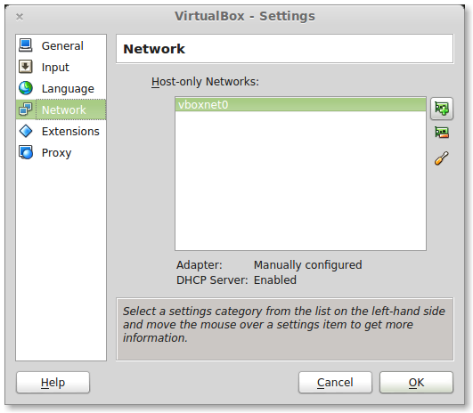
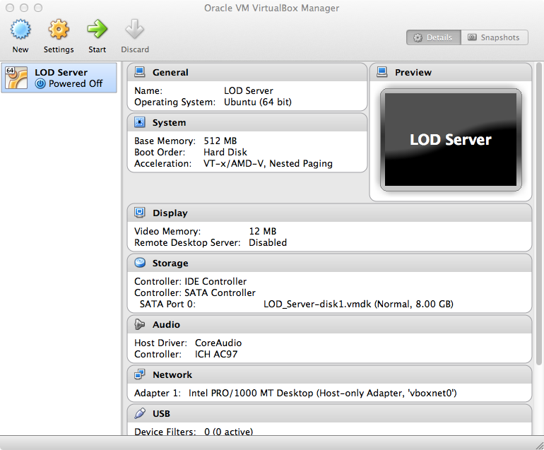

Set up VirtualBox
=================

These instructions are for setting up a RPi like virtual machine in VirtualBox. The chosen OS is Ubuntu Server 64bit which is similar to Raspbian and limited resources have been set to emulate the RPi hardware. More resources are certainly allowed, but the limited memory and CPU power highlight the flexibility of these systems.

To begin with, we need to add a Host-only Network to the VirtualBox application. This allows us to work with our Ubuntu Servers so we can SSH and access the server from the host (your laptop).

+ Open up VirtualBox and go to *File* -> *Preferences* -> *Network*
+ Add a Network by clicking on the icon with the NIC and '+'



Setting up your VirtualBox host on a Host-only network will not allow you to connect to the outside world, so you won't be able to apt-get new packages. If you need access to the internet, change your VirtualBox guest machine settings to NAT and restart your LOD Server VM. The {{LOD_Server.ova}} image, mentioned below, has an up-to-date version of Ubuntu Server and the Virtuoso Open Source software installed.

+ Import the prepared VirtualBox Appliance for the tutorial, {{LOD_Server.ova}}
	+ Untick the DVD option to better reflect a RPi or Server
	+ Make sure the USB2.0 for the guest is also disabled, unless you have Oracle VM VirtualBox Extension Pack for the host
+ Start the {{LOD Server}} VM



Once the virtual machine is started you can SSH into the server from your host (laptop). The default ip of the guest is {{192.168.56.101,}} so use that ip for SSH as well as connecting to the VOS Conductor interface.

+ __username__: pi
+ __password__: password

```
$ ssh pi@192.168.56.101
pi@192.168.56.101's password:
Welcome to Ubuntu 12.04.3 LTS (GNU/Linux 3.8.0-29-generic x86_64)

 * Documentation:  https://help.ubuntu.com/

  System information as of Wed Nov  6 15:12:49 GMT 2013

  System load:  0.37              Processes:           79
  Usage of /:   19.9% of 6.99GB   Users logged in:     0
  Memory usage: 50%               IP address for eth0: 192.168.56.101
  Swap usage:   0%

  Graph this data and manage this system at https://landscape.canonical.com/

Last login: Wed Nov  6 15:04:28 2013 from 192.168.56.1
pi@ubuntu:~$
```

When the virtual machine is running you can also fire up the VOS Conductor interface at:

+ <http://192.168.56.101:8890/conductor/>
+ __username__: dba
+ __password__: dba

Keep the VirtualBox virtual machine running in the background of your workstation for the rest of the tutorial. We'll be interacting with it both via the command line and web interface.


[next](3-set-up-virtuoso.md)
