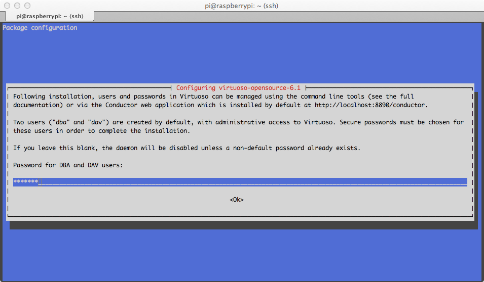
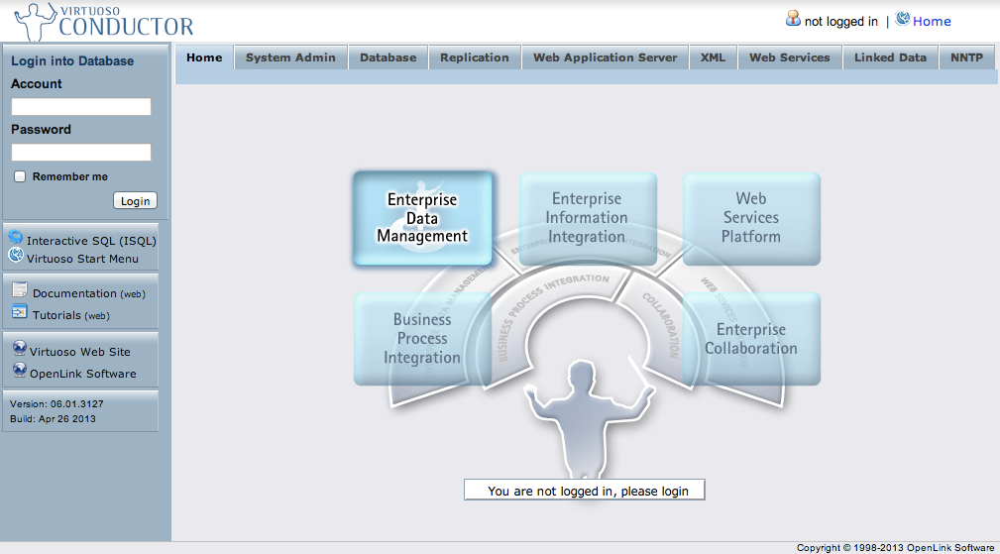

Set up Virtuoso Open Source Server
==================================

If you've come here from the VirtualBox setup page, this has already been done for you in the `LOD_Server.ova` image. Please read on regardless to get a better understanding of what steps were taken to get you there.

From now on we will refer to the RPi and VirtualBox virtual machine as our LOD Server. This term will be used interchangeably and the commands that follow should work for either set up.

Install Virtuoso
----------------

+ Use the following command to install Virtuoso Open Source (VOS) Server from the Debian package manager
	+ `sudo apt-get install virtuoso-opensource`

```
pi@raspberrypi ~ $ sudo apt-get install virtuoso-opensource
Reading package lists... Done
Building dependency tree       
Reading state information... Done
The following extra packages will be installed:
  imagemagick-common liblqr-1-0 libmagickcore5 libmagickwand5 libvirtodbc0 libwbxml2-0 odbcinst odbcinst1debian2
  virtuoso-opensource-6.1 virtuoso-opensource-6.1-bin virtuoso-opensource-6.1-common virtuoso-server virtuoso-vad-conductor
  virtuoso-vsp-startpage
Suggested packages:
  libmagickcore5-extra virtuoso-vad-doc virtuoso-vad-demo virtuoso-vad-tutorial virtuoso-vad-rdfmappers virtuoso-vad-sparqldemo
  virtuoso-vad-syncml virtuoso-vad-bpel virtuoso-vad-isparql virtuoso-vad-ods virtuoso-vad-dbpedia virtuoso-vad-facetedbrowser
The following NEW packages will be installed:
  imagemagick-common liblqr-1-0 libmagickcore5 libmagickwand5 libvirtodbc0 libwbxml2-0 odbcinst odbcinst1debian2 virtuoso-opensource
  virtuoso-opensource-6.1 virtuoso-opensource-6.1-bin virtuoso-opensource-6.1-common virtuoso-server virtuoso-vad-conductor
  virtuoso-vsp-startpage
0 upgraded, 15 newly installed, 0 to remove and 0 not upgraded.
Need to get 0 B/10.1 MB of archives.
After this operation, 29.9 MB of additional disk space will be used.
Do you want to continue [Y/n]? y
Preconfiguring packages ...
Selecting previously unselected package imagemagick-common.
(Reading database ... 65305 files and directories currently installed.)
Unpacking imagemagick-common (from .../imagemagick-common_8%3a6.7.7.10-5+deb7u2_all.deb) ...
Selecting previously unselected package liblqr-1-0:armhf.
Unpacking liblqr-1-0:armhf (from .../liblqr-1-0_0.4.1-2_armhf.deb) ...
Selecting previously unselected package libmagickcore5:armhf.
Unpacking libmagickcore5:armhf (from .../libmagickcore5_8%3a6.7.7.10-5+deb7u2_armhf.deb) ...
Selecting previously unselected package libmagickwand5:armhf.
Unpacking libmagickwand5:armhf (from .../libmagickwand5_8%3a6.7.7.10-5+deb7u2_armhf.deb) ...
Selecting previously unselected package odbcinst.
Unpacking odbcinst (from .../odbcinst_2.2.14p2-5_armhf.deb) ...
Selecting previously unselected package odbcinst1debian2:armhf.
Unpacking odbcinst1debian2:armhf (from .../odbcinst1debian2_2.2.14p2-5_armhf.deb) ...
Selecting previously unselected package virtuoso-opensource-6.1-common.
Unpacking virtuoso-opensource-6.1-common (from .../virtuoso-opensource-6.1-common_6.1.4+dfsg1-7+rpi1_armhf.deb) ...
Selecting previously unselected package virtuoso-opensource-6.1-bin.
Unpacking virtuoso-opensource-6.1-bin (from .../virtuoso-opensource-6.1-bin_6.1.4+dfsg1-7+rpi1_armhf.deb) ...
Selecting previously unselected package libvirtodbc0.
Unpacking libvirtodbc0 (from .../libvirtodbc0_6.1.4+dfsg1-7+rpi1_armhf.deb) ...
Selecting previously unselected package libwbxml2-0.
Unpacking libwbxml2-0 (from .../libwbxml2-0_0.10.7-1_armhf.deb) ...
Selecting previously unselected package virtuoso-opensource-6.1.
Unpacking virtuoso-opensource-6.1 (from .../virtuoso-opensource-6.1_6.1.4+dfsg1-7+rpi1_armhf.deb) ...
Selecting previously unselected package virtuoso-opensource.
Unpacking virtuoso-opensource (from .../virtuoso-opensource_6.1.4+dfsg1-7+rpi1_all.deb) ...
Selecting previously unselected package virtuoso-server.
Unpacking virtuoso-server (from .../virtuoso-server_6.1.4+dfsg1-7+rpi1_all.deb) ...
Selecting previously unselected package virtuoso-vad-conductor.
Unpacking virtuoso-vad-conductor (from .../virtuoso-vad-conductor_6.1.4+dfsg1-7+rpi1_all.deb) ...
Selecting previously unselected package virtuoso-vsp-startpage.
Unpacking virtuoso-vsp-startpage (from .../virtuoso-vsp-startpage_6.1.4+dfsg1-7+rpi1_all.deb) ...
Processing triggers for man-db ...
Setting up imagemagick-common (8:6.7.7.10-5+deb7u2) ...
Setting up liblqr-1-0:armhf (0.4.1-2) ...
Setting up libmagickcore5:armhf (8:6.7.7.10-5+deb7u2) ...
Setting up libmagickwand5:armhf (8:6.7.7.10-5+deb7u2) ...
Setting up virtuoso-opensource-6.1-common (6.1.4+dfsg1-7+rpi1) ...
Setting up virtuoso-opensource-6.1-bin (6.1.4+dfsg1-7+rpi1) ...
Setting up libwbxml2-0 (0.10.7-1) ...
Setting up odbcinst (2.2.14p2-5) ...
Setting up odbcinst1debian2:armhf (2.2.14p2-5) ...
Setting up libvirtodbc0 (6.1.4+dfsg1-7+rpi1) ...
Setting up virtuoso-opensource-6.1 (6.1.4+dfsg1-7+rpi1) ...
[ ok ] Starting Virtuoso OpenSource Edition 6.1 : virtuoso-opensource-6.1.
Setting up virtuoso-opensource (6.1.4+dfsg1-7+rpi1) ...
Setting up virtuoso-server (6.1.4+dfsg1-7+rpi1) ...
Setting up virtuoso-vad-conductor (6.1.4+dfsg1-7+rpi1) ...
Setting up virtuoso-vsp-startpage (6.1.4+dfsg1-7+rpi1) ...
```

+ As part of the installation, Debian will ask you for passwords to use for the dba and dav users; if you leave it blank, the virtuoso service will not start after installation



+ If the installation fails, the dba and dav users passwords may not be updated. If so default passwords will be used (dba/dba and dav/dav)
+ After the install, the `virtuoso-t` command should have started automatically, but if not, you can start and stop VOS with the commands below
+ These instructions were mostly taken from the [OpenLink Software Guide](http://virtuoso.openlinksw.com/dataspace/doc/dav/wiki/Main/VOSDebianNotes) which should be consulted for more information
+ Now modify the `virtuoso.ini` file to enable the rdf loader we'll use later to work

```
pi@ubuntu:~$ sudo nano /etc/virtuoso-opensource-6.1/virtuoso.ini
[sudo] password for pi:
```

+ Add the home directory to the `DirsAllowed` property

```
;
;  Server parameters
;
[Parameters]
ServerPort               = 1111
LiteMode                 = 0
DisableUnixSocket        = 1
DisableTcpSocket         = 0
;SSLServerPort           = 2111
;SSLCertificate          = cert.pem
;SSLPrivateKey           = pk.pem
;X509ClientVerify        = 0
;X509ClientVerifyDepth   = 0
;X509ClientVerifyCAFile  = ca.pem
ServerThreads            = 20
CheckpointInterval       = 60
O_DIRECT                 = 0
CaseMode                 = 2
MaxStaticCursorRows      = 5000
CheckpointAuditTrail     = 0
AllowOSCalls             = 0
SchedulerInterval        = 10
DirsAllowed              = ., /usr/share/virtuoso-opensource-6.1/vad,/home/pi
ThreadCleanupInterval    = 0
```

Locations
---------

|config file| `/etc/virtuoso-opensource-6.1/virtuoso.ini`|
|binary     | `/usr/bin/virtuoso-t`|
|logs       | `/var/lib/virtuoso-opensource-6.1/db/virtuoso.log`|

Commands
--------

|start|`sudo /etc/init.d/virtuoso-opensource-6.1 start`|
|stop|`/etc/init.d/virtuoso-opensource-6.1 stop`|
|restart|`/etc/init.d/virtuoso-opensource-6.1 restart`|
|view logs|`tail -f /var/lib/virtuoso-opensource-6.1/db/virtuoso.log`|

Web Admin
---------

VOS has a web interface for managing the server. This lives locally at:

+ <http://localhost:8890/conductor>

However since we are not working directly on our LOD Server, we need to access it from our laptops via the IP address. Replace `localhost` with the IP address of your LOD Server to log into the VOS web admin.



Now that VOS is running and ready to go, we need to create some RDF to publish as Linked Open Data

[previous](1-set-up-rpi.md) | [next](4-create-rdf.md)
