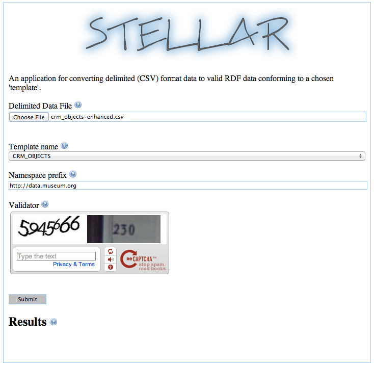
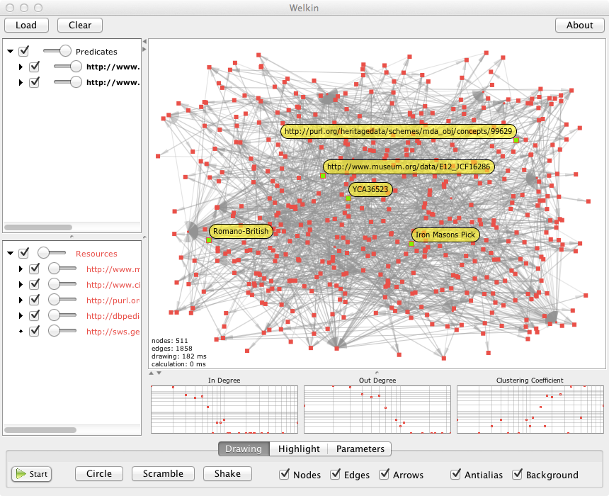
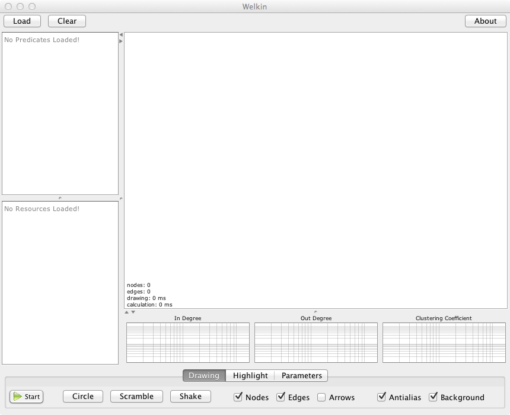

Create RDF from Relational Data
===============================

If you brought data with you this is were we can go through the process of creating RDF with the [STELLAR tools](http://hypermedia.research.southwales.ac.uk/resources/STELLAR-applications/). This process will be different for everyone, but a general workflow will be described to support atendees in the process. A sample dataset will be used as an exemplar for this workflow, which will hopefully closely resemble your own data.

If you already have RDF ready to be imported into VOS, go on to the [next](5-set-up-vos-for-lod.md) section.

Know Your Data
--------------

To be able to successfully convert your data from tabular data to RDF, you need to understand what all of the fields in your dataset mean. The tool we will use for creating the RDF/XML is the STELLAR tools, which will effectively "translate" your data to RDF. If you are using the sample data kindly provided by [The British Museum (BM)](https://docs.google.com/spreadsheet/ccc?key=0AjpVt48bVrZxdEw5aS1fdEU5d25lUWw5dFdiZkljdGc&usp=sharing), take this moment to have a look at it and get to grips with it. The easiest way to view the BM data is with an application like Excel, but any text editor will work.

### BM Cheat Sheet ###

|Concept|
|------ |
|PRN|
|Label|
|Period Culture|
|Place|
|Country|
|Material|
|Object Name|
|Description|

Know Your Tool
--------------

The tool we are going to use to convert the relational data is the [STELLAR.Web tool](http://reswin1.isd.glam.ac.uk/stellar/default.aspx) developed by Ceri Binding at the University of South Wales. If you have access to a Windows machine, you can also use the [STELLAR.Console tool](http://reswin1.isd.glam.ac.uk/stellar/tutorials/tutorial1.html), which allows you to use custom templates and offers more functionality compared to the STELLAR.Web tool.

The STELLAR tools convert relational data to RDF/XML by using interchangeable templates. These RDF/XML outputs also conform to the CIDOC-CRM. The templates used for the translation are important, since each template has been customised to represent a particular type of data. The template we will be looking at in this tutorial is a custom built one for the workshop, the __crm_objects__ template. There are more templates available, most of which relate to the CRM-EH extension and relate in particular to excavation data.

Know Your Template
------------------

The CRM Objects template was created to use with this tutorial since no other existing templates were suitable to represent basic object data within the CIDOC CRM. Most of the templates for the STELLAR project were created to represent excavation data within an extension of the CIDOC CRM. The closest was the CLAROS templates, which was originally used to represent art data. Unfortunately the CLAROS templates had built in many conditions for the idiosyncratic data they held, so it wasn't very transferrable to other uses outside of their project. The CLAROS Objects template was useful as a starting point, and the new more generic CRM Objects template used the [CLAROS Objects](http://reswin1.isd.glam.ac.uk/stellar/STELLAR-CLAROS.pdf) as a base line.

The templates work by parsing a CSV file, identifying specific column headers, and inserting those columns data into the appropriate place within the template. The end product is a clean RDF/XML representation of the realational data.

### Column Headers ###

The following are the column header names the CRM Objects template will be expecting, so change the relevant column headers to one of the following:

|object_id|[Mandatory] A string value that serves to uniquely identify the object within its source dataset|
|object_label|A short human-readable label for describing the object in user interfaces|
|object_title|A (definitive) descriptive title for the object|
|object_type_label|A string that identifies a particular type of object; e.g. pottery, statue, gem|
|object_type_uri|A URI that identifies a particular type of object|
|find_place_label|Description of place|
|find_place_uri|URI of place described elsewhere|
|production_period_label|A short human-readable label for describing the period in user interfaces|
|production_period_uri|A globally unique URI that identifies a particular period|
|production_material_label|Label for this material|
|production_material_uri|URI for this material|

### BM Cheat Sheet ###

|object_id|PRN|
|object_label|Description|
|object_title|Label|
|object_type_label|Object Name|
|find_place_label|Place|
|production_period_label|Period Culture|
|production_material_label|Material|

LinkedDataToolkit
-----------------

The eagle-eyed of you will notice that we've left off the `*_uri` fields. That's because they don't exist (in our BM data, but kudos if they already exist in yours) and we'll be using another toolkit to populate those fields via lookups to existing vocabularies with SPARQL endpoints. This toolkit, the LinkedDataToolkit, is a simple Java application which contains a series of lookups to SPARQL or REST endpoints. The LinkedDataToolkit expects the column headers above and then will look up the values in those fields against the appropriate vocabulary or authority:

+ object_type_label       -> [FISH Archaeological Objects Thesaurus](http://heritagedata.org/test/schemes/mda_obj.html)
+ find_place_label        -> [Geonames](http://www.geonames.org/)
+ production_period_label -> [EH Periods](http://heritagedata.org/test/schemes/eh_period.html)
+ production_material     -> [DBpedia](http://dbpedia.org/)

Those vocabularies are not obviously perfect for all datasets, and has a noticeable bias towards UK authorities and English. The FISH Archaeological Objects and EH Periods Thesauri are maintained by English Heritage, so will not match all datasets. The DBpedia source is rather generic but does act as a suitable vocabulary for materials. The source code for the LinkedDataToolkit is available from Github, so if there are other SPARQL endpoints you want to use instead of the ones provided feel free to modify it accordingly. For the sake of this workshop, these vocabularies should provide useful coverage.

One additional field can be utilised by the LinkedDataToolkit, which is a country field. This field makes the lookup into Geonames more accurate since placenames are notoriously difficult to align. If your dataset has a field for countries rename it to *country*. If your dataset doesn't have a countries field but all of the data is from the same country, you can add a command line parameter to the LinkedDataToolkit to lookup in the apporpriate country.

### Running the LinkedDataToolkit ###

The following instructions will walk you through the process of enhancing your CSV data with Linked Data lookups.

+ Download the [LinkedDataToolkit.zip](http://charno.net/data/LinkedDataToolkit.zip) file and extract it to your local machine
+ Make sure the lib directory is in the same location as the LinkedDataToolkit.jar file
+ Open up a terminal and navigate to the directory you expanded the zip to
+ The LinkedDataToolkit expects 3 command line parameters:
	+ FILE_NAME: [Mandatory] The path and file name of the CSV file you want enhanced (ie. /home/mcharno/documents/crm_objects.csv)
	+ GEONAMES_USER: [Mandatory] The username for the [Geonames API](http://www.geonames.org/login)
	+ COUNTRY: A Geonames country code (ie. GB for United Kingdom)
+ Execute the following command to run the lookups and create the new *enhanced* CSV file
	+ `java -jar LinkedDataToolkit.jar [FILE_PATH_NAME] [GEONAMES_USER]`

```
pi@ubuntu $ java -jar LinkedDataToolkit.jar /Users/charno/Desktop/BellingTheCat/crm_objects.csv geonamesuser
Following headers with potential lookups found:
	object_type_label
	find_place_label
	production_period_label
	production_material_label
BCB287
	object_type_uri=http://purl.org/heritagedata/schemes/mda_obj/concepts/95795
	find_place_uri=http://sws.geonames.org/2654897
	production_period_uri=http://purl.org/heritagedata/schemes/eh_period/concepts/NE
	production_material_uri=http://dbpedia.org/resource/Antler
BCB2595
	object_type_uri=http://purl.org/heritagedata/schemes/mda_obj/concepts/96755
	find_place_uri=http://sws.geonames.org/2646302
	production_material_uri=http://dbpedia.org/resource/Pewter
BCB2592
	object_type_uri=http://purl.org/heritagedata/schemes/mda_obj/concepts/96755
	find_place_uri=http://sws.geonames.org/2646302
	production_material_uri=http://dbpedia.org/resource/Pewter
		.
		.
		.
YCA40958
	object_type_uri=http://purl.org/heritagedata/schemes/mda_obj/concepts/95796
	find_place_uri=http://sws.geonames.org/349653
	production_material_uri=http://dbpedia.org/resource/Iron
--------------------------------------------
New file written to /Users/charno/Desktop/BellingTheCat/crm_objects-enhanced.csv
```

+ The new file is listed at the bottom of the output, but should have *enhanced* inserted at the end of the old filename

### Create RDF/XML ###

With the new *enhanced* CSV file, we are now ready to use the STELLAR.Web tool to create RDF/XML.

+ Open up a web browser and navigate to the [STELLAR.Web](http://reswin1.isd.glam.ac.uk/stellar/default.aspx) tool
+ The STELLAR.Web tool requires 3 things:
	+ CSV File
	+ Template
	+ Namespace Prefix: This will be the URL root that all local resources will live (ie. object ids)



+ Download the created file (the link is underneath the Submit button)
+ You can open the file and look at it, but it should be dense XML so its not recomended
	+ If you want to see what your data looks like, you can open it in a special semantic browser, such as [SemanticWorks](http://www.w3.org/2001/sw/wiki/SemanticWorks), [Gruff](http://www.franz.com/agraph/gruff/), [RDF-Gravity](http://semweb.salzburgresearch.at/apps/rdf-gravity/index.html), or [Simile Welkin](http://simile.mit.edu/welkin/).



### Simile Welkin ###

An easy tool to quickly visualise RDF data is Simile Welkin from MIT. To set it up:

+ First download the Simile Welkin [tarball](http://simile.mit.edu/dist/welkin/welkin-1.1.tar.gz)
+ Extract it to your working directory
+ Set the `JAVA_HOME` variable for your machine
	+ On Mac/*nix machines that can be set in your `.bash_profile` with the following line

```
MAC
export JAVA_HOME=$(/usr/libexec/java_home)

LINUX
export JAVA_HOME=/usr/lib/jvm/java-7-oracle
```

+ Activate your new path settings with the following command

```
$ source ~/.bash_profile
```

+ Navigate to Welkin directory and run the Welkin script

```
$ ./welkin.sh
```



+ Load the RDF data and have a play

Now we are ready to load our data into the triple store and make it accessible as Linked Open Data.

[previous](3-set-up-virtuoso.md) | [next](5-set-up-vos-for-lod.md)
